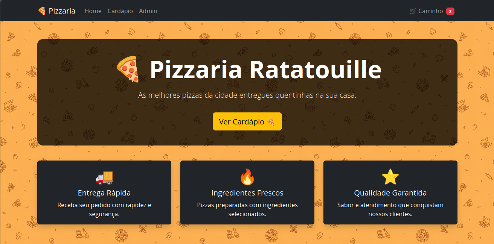
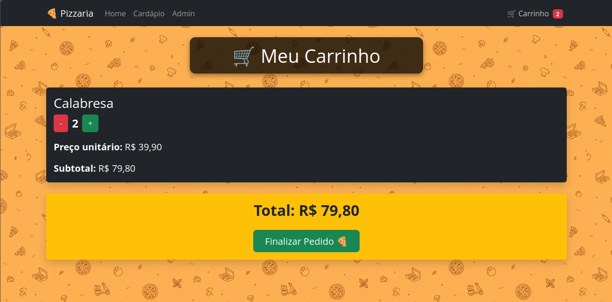
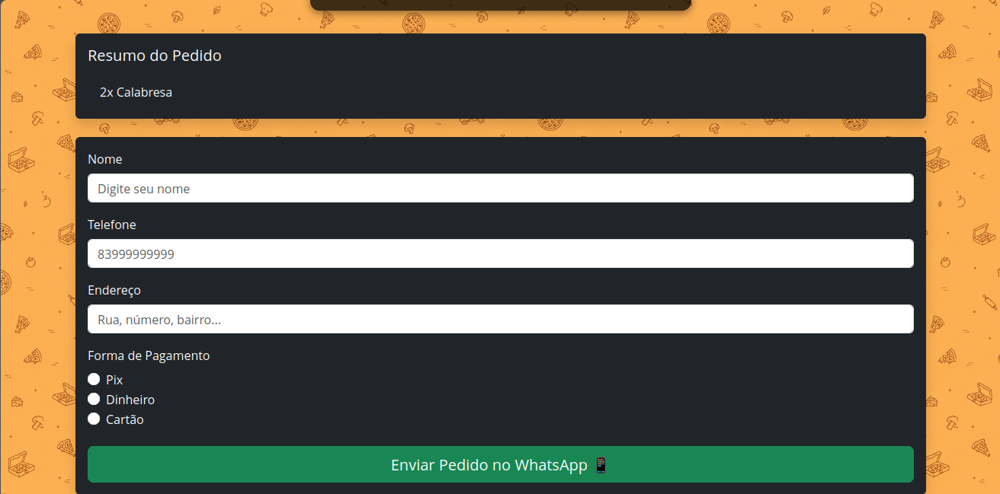

# 🍕 PizzaShop

Aplicação web para pedidos de pizzaria desenvolvida com React no frontend e Node.js + Express no backend.

O sistema permite que o cliente escolha pizzas e bebidas, adicione produtos ao carrinho, informe seus dados e finalize o pedido pelo WhatsApp.


## ✨ Funcionalidades

- Listagem de pizzas
- Listagem de bebidas
- Carrinho de compras
- Alteração da quantidade dos produtos
- Remoção de itens do carrinho
- Cálculo automático do valor total
- Finalização do pedido
- Envio do pedido para o WhatsApp
- Integração com API própria

## 🛠️ Tecnologias

### Frontend

- React
- Vite
- React Router
- Context API
- Axios
- React Bootstrap

### Backend

- Node.js
- Express
- CORS

## 📂 Estrutura do projeto

```
Frontend
├── React
├── Context API
├── Axios
└── React Bootstrap

Backend
├── Express
├── Routes
├── Services
└── db.json
```

## ▶️ Como executar

### Frontend

```bash
npm install
npm run dev
```

### Backend

```bash
npm install
npm start
```

## 📸 Demonstração

<table align="center">
  <tr>
    <td align="center">
      <br>
      <strong>Página Inicial</strong>
    </td>
    <td align="center">
      <br>
      <strong>Carrinho</strong>
    </td>
  </tr>
  <tr>
    <td align="center">
      <br>
      <strong>Checkout</strong>
    </td>
    <td align="center">
      <br>
      <strong>Pedido no WhatsApp</strong>
    </td>
  </tr>
</table>


## 📌 Próximas melhorias

- Painel administrativo
- Banco de dados
- Autenticação de administrador
- Acompanhamento de pedidos
- Histórico de pedidos

## 👨‍💻 Autor

**Júnior Gomes**


